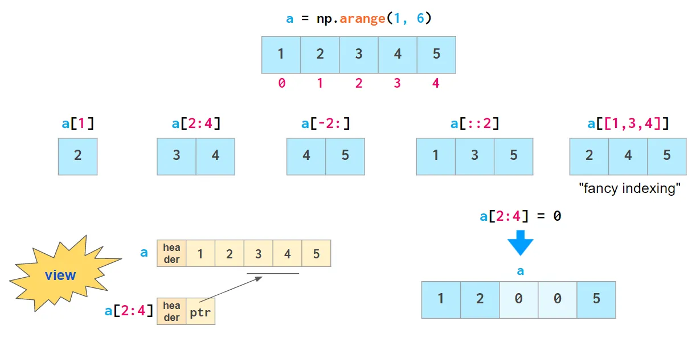
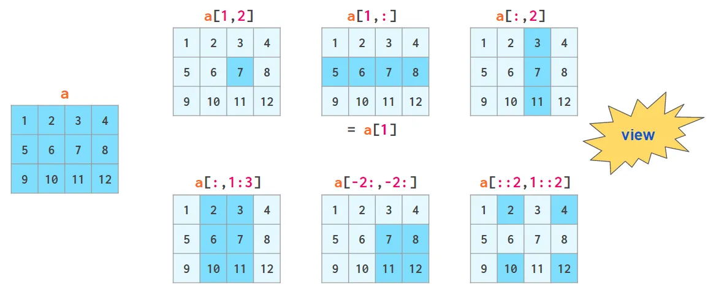
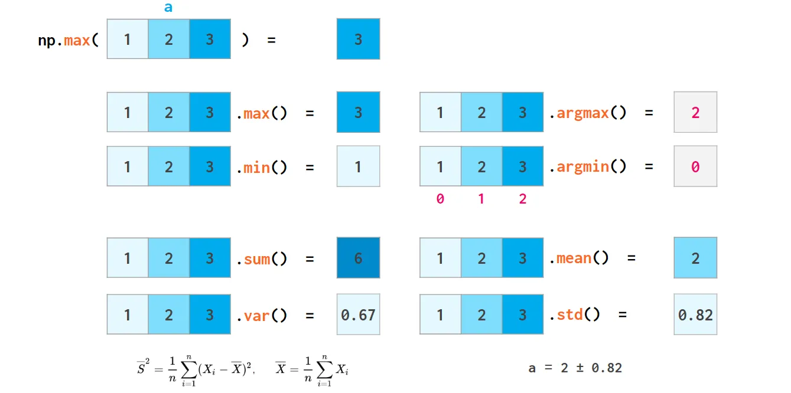
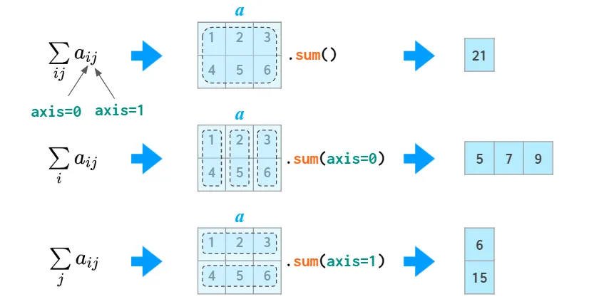
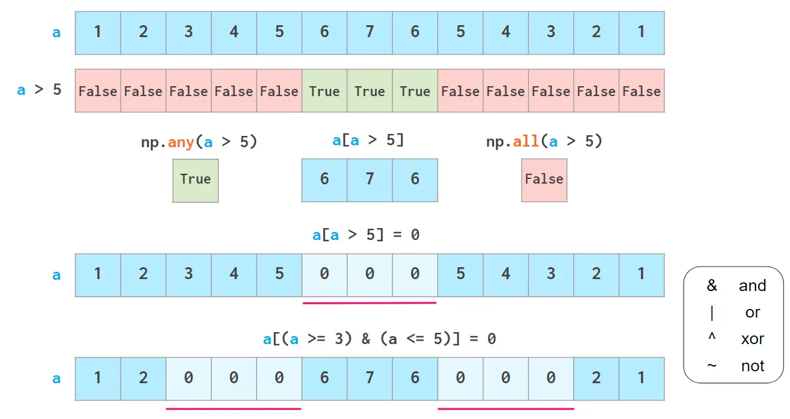
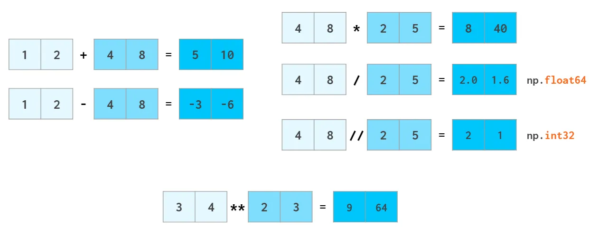

# Lernsituation: Analyse von NYC Yellow Taxi Trip-Daten mit NumPy


## Themengebiete:
1. Laden einer CSV-Datei als NumPy-Array  
2. Indexierung und Slicing von Arrays  
3. Berechnungen und statistische Analysen  
4. Filtern und Bedingte Auswahl  
5. Speichern von berechneten Ergebnissen  

---

## Einleitung  

In dieser Lernsituation analysieren wir die NYC Yellow Taxi Trip-Daten. Die Daten umfassen Informationen wie Fahrtstrecken, Fahrtdauer, Fahrpreise und mehr. NumPy bietet leistungsstarke Werkzeuge zur Analyse von numerischen Daten, mit denen wir verschiedene Berechnungen effizient durchführen können.  

**Datenfelder (Data Dictionary):**  
- `tpep_pickup_datetime`: Startzeit der Fahrt  
- `tpep_dropoff_datetime`: Endzeit der Fahrt  
- `Passenger_count`: Anzahl der Passagiere  
- `Trip_distance`: Strecke der Fahrt in Meilen  
- `Fare_amount`: Fahrpreis  
- `Total_amount`: Gesamtbetrag der Fahrt  
- `Payment_type`: Zahlungsart  

---

## Aufgaben  

### 1. Laden der CSV-Datei als NumPy-Array  

**Lernziel:** Verstehen, wie man eine CSV-Datei mit NumPy einliest.  

**Anleitung:**  
- Experimentiere mit `numpy.loadtxt` oder `numpy.genfromtxt` zum Einlesen.  
- Arbeite korrekt mit Trennzeichen (z.B. Komma).  
- Lade nur die ersten **100 Zeilen**, um den Speicherbedarf zu reduzieren.  

**Beispielcode:**  
```python
import numpy as np
# Ein Beispielarray erstellen (anstelle der Datei)
beispiel_data = """1,2,3
4,5,6
7,8,9""".splitlines()
array = np.genfromtxt(beispiel_data, delimiter=",")
print(array)
```

**Aufgaben:**  
- Lade die Daten aus `taxi_tripdata.csv`.  
- Gib die Dimension des Arrays aus.  

---

### 2. Indexierung und Slicing von Arrays  

**Lernziel:** Daten aus spezifischen Spalten extrahieren und analysieren.  

**Aufgaben:**  
1. Extrahiere die Spalte **`Trip_distance`**.  
2. Wähle alle Zeilen aus, bei denen `Passenger_count` genau **1** ist.  
3. Wähle gezielt einen Bereich aus: **Zeilen 10 bis 20** und **Spalten 2 bis 4**.  
4. Extrahiere **jede zweite Zeile** der Daten.  
5. Extrahiere die **letzte Spalte** des Arrays.  

**Beispielcode:**  
```python
import numpy as np
array = np.array([[1, 2, 3], [4, 5, 6], [7, 8, 9]])
print("Original Array:")
print(array)

# Spalte extrahieren
print("Spalte 2:", array[:, 1])

# Jede zweite Zeile
print("Jede zweite Zeile:", array[::2])

# Letzte Spalte
print("Letzte Spalte:", array[:, -1])
```


---

### 3. Berechnungen und statistische Analysen  

**Lernziel:** Statistiken wie Mittelwert, Median und Summe berechnen.  

**Aufgaben:**  
1. Berechne den **Durchschnitt** der Spalte `Trip_distance`.  
2. Ermittle den **Median** und die **Standardabweichung** der Spalte `Fare_amount`.  
3. Summiere die Werte der Spalte `Total_amount`.  
4. Zähle Fahrten mit genau **0 Passagieren**.  
5. Die Summe aller Spalten 

**Beispielcode:**  
```python
import numpy as np
array = np.array([1, 2, 3, 4, 5, 6])
print("Mittelwert:", np.mean(array))
print("Median:", np.median(array))
print("Summe:", np.sum(array))
```


**Reflexionsfragen:**  
- Was sagt die Standardabweichung über die Daten aus?  
- Wie beeinflussen Ausreißer den Durchschnitt und Median?  

---

### 4. Filtern und Bedingte Auswahl  

**Lernziel:** Bestimmte Bedingungen auf Arrays anwenden und gefilterte Ergebnisse analysieren.  

**Aufgaben:**  
1. Finde alle Fahrten, bei denen `Trip_distance > 5` Meilen war.  
2. Ermittle Fahrten, bei denen `Fare_amount` zwischen **10 und 20 Dollar** liegt.  
3. Kombiniere Bedingungen: Fahrten mit mehr als **2 Passagieren** und einer Strecke unter **2 Meilen**. 
4. Gibt es Fahrten, die **keine Passagiere** hatten?

**Beispielcode:**  
```python
import numpy as np
array = np.array([10, 15, 5, 25, 30])
print("Werte > 10:", array[array > 10])
print("Werte zwischen 10 und 20:", array[(array >= 10) & (array <= 20)])
```

**Reflexionsfragen:**  
- Wie funktionieren logische Operatoren (`&`, `|`) in NumPy?  
- Was passiert, wenn keine Zeilen die Bedingung erfüllen?  

---

### 5. Vektorisierung und Effizienz

**Lernziel:** Verstehen, wie Vektorisierung die Effizienz von Berechnungen verbessert.

**Aufgaben:**
1. Berechne den **Fahrpreis pro Meile** für jede Fahrt.
2. In den Daten hat sich ein Fehler eingeschlichen: Erhöhe alle `Fare_amount` um **10%**.
3. **Vergleiche** die Laufzeit von vektorisierten und nicht-vektorisierten Berechnungen.




### 6. Speichern von Ergebnissen  

**Lernziel:** Ergebnisse in neue Dateien exportieren.  

**Aufgaben:**  
1. Speichere ein gefiltertes Subset der Daten als **CSV-Datei**.  
2. Experimentiere mit verschiedenen Speicherformaten und Optionen.  

**Beispielcode:**  
```python
import numpy as np
array = np.array([[1, 2, 3], [4, 5, 6]])
np.savetxt('output.csv', array, delimiter=',')
```

**Reflexionsfragen:**  
- Warum ist das richtige Format beim Speichern wichtig?  
- Wie kann Speicherplatz gespart werden?  

---

## Weitere Aufgaben  

1. **Zeitbasierte Analysen:** Berechne die durchschnittliche Fahrtdauer in Minuten.  
2. **Vergleich der Zahlungsarten:** Wie viele Fahrten wurden per Kreditkarte oder bar bezahlt?  
3. **Analyse der Passagieranzahl:** Finde die Fahrt mit den meisten Passagieren.  
4. **Streckenanalyse:** Identifiziere die kürzesten und längsten Fahrten und berechne die durchschnittliche Fahrtstrecke.  
5. **Beliebtester Endpunkt:**  
   - Ermittle das häufigste `DOLocationID` (Zielgebiet).  
   - Berechne die Anzahl der Fahrten zu diesem Ziel.  

---

## Abschluss  

In dieser Lernsituation hast du gelernt:  
- Wie man Daten mit **NumPy** lädt und manipuliert.  
- Wie man Berechnungen und Filterungen durchführt.  
- Wie man Ergebnisse speichert und weiterverwendet.  

Du bist jetzt in der Lage, große Datensätze effizient mit NumPy zu analysieren.  
